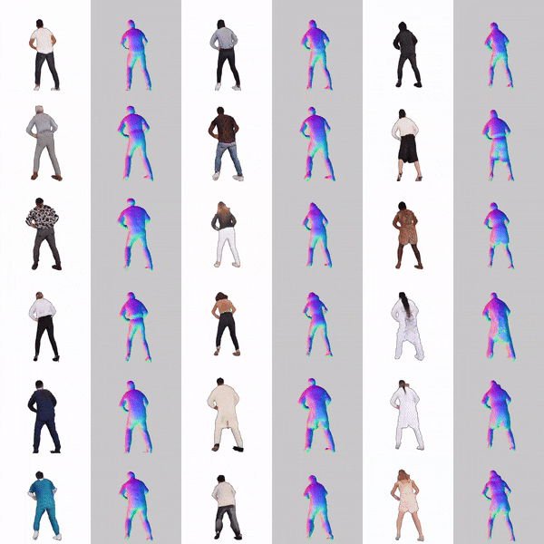
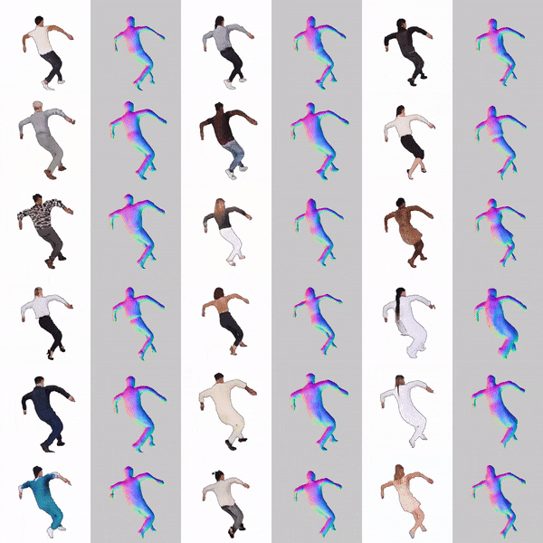
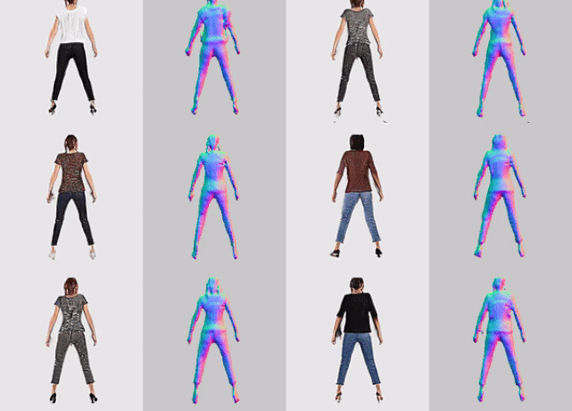
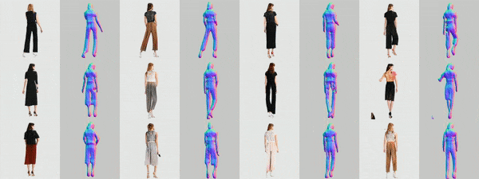

# AvatarGen: A 3D Generative    Model  for  Animatable Human Avatars
Code repository for the paper:  
**AvatarGen: A 3D Generative    Model  for  Animatable Human Avatars**  
[Jianfeng Zhang](https://jeff95.me)\*, [Zihang Jiang](https://zihangjiang.github.io/)\*, [Dingdong Yang](https://santisy.github.io/), [Hongyi Xu](http://www-scf.usc.edu/~hongyixu/), [Yichun Shi](https://seasonsh.github.io/),  [Guoxian Song](https://guoxiansong.github.io/homepage/index.html),  [Zhongcong Xu](https://github.com/zcxu-eric), [Xinchao Wang](https://sites.google.com/site/sitexinchaowang/), [Jiashi Feng](https://sites.google.com/site/jshfeng/)  
Arxiv Preprint, 2022 <br>
[[paper](https://arxiv.org/pdf/2208.00561.pdf)] [[project page](http://jeff95.me/projects/avatargen.html)]


## Demo Videos

**Please check out our latest high-resolution (512x512) results!**
<table style="border:0px">
   <tr>
       <td></td>
       <td></td>
   </tr>

<table style="border:0px">
   <tr>
       <td></td>
       <td></td>
   </tr>
</table>

</table>
<table style="border:0px">
   <tr>
       <td></td>
       <td></td>
   </tr>
</table>


<table style="border:0px">
   <tr>
       <td></td>
   </tr>
</table>


## Citation
If you  find the idea or code of this paper useful for your research, please consider citing us:

```bibtex
@inproceedings{zhang2022avatargen,
  title      = {AvatarGen: A 3D Generative Model for Animatable Human Avatars},
  author     = {Zhang, Jianfeng and Jiang, Zihang and Yang, Dingdong and Xu, Hongyi and Shi, Yichun and Song, Guoxian and Xu, Zhongcong and Wang, Xinchao and Feng, Jiashi},
  booktitle  = {Arxiv},
  year       = {2022}
}
```
